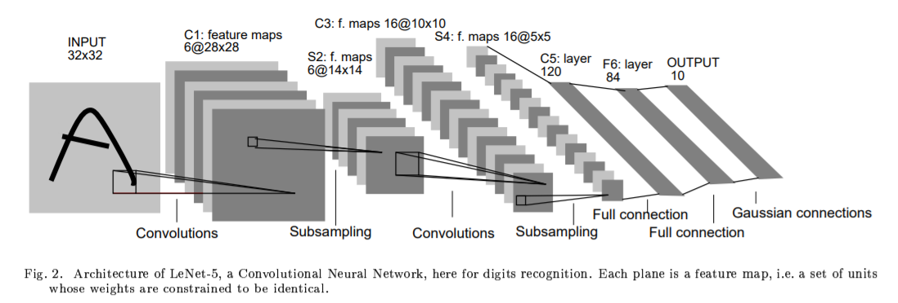

# README

# [개인과제] MNIST 분류기 학습: LeNet5, CustomMLP

## 모델 구조 설명

### LeNet-5

MNIST Dataset은 28*28의 Grayscale이미지로 이루어져있으나, LeNet-5의 인풋은 Border를 추가하여 32*32 이미지가 된다.

LeNet5는 3개의 컨볼루션 레이어인 C1,C2,C3과 2개의 서브샘플링 레이어인 S2,S4, 1개의 Fully Connected Layer인 F6, 가우시안 커넥션으로 구성된다. 마지막단에 Euclidean Radil Basis Function unit 대신 FullyConnected Layer와 Softmas함수 롤 사용하여 임의로 F7를 추가하였다.

- **C1 : 5x5x1 filter , 6개**

    필터가 한 픽셀 간격으로 움직이며 컨볼루션 연산을 하여 feature map을 출력한다.

    `(output feature의 크기) = (32-5)/1 + 1 = 28`

    `(output feature의 channel) = (filter의 개수) = 6`

    `(파라미터의 개수) = (5x5 + 1) x 6 =  156`

- **S2: 2x2 filter, stride 2, Maxpooling + Sigmoidal function**

    2x2에 속하는 값 중 가장 큰 값을 출력한다. 필터는 두 픽셀 간격으로 움직인다. 논문에서는 Average pooling 기법을 사용한 뒤 학습 가능한 바이어스를 더한 후 Sigmoidal function에 적용하였으나, 위 구현에서는 해당 파라미터를 제외한 뒤 Sigmoidal function만 사용하였다.

    `(output feature의 크기) = (28-2)/2 + 1 = 14`

    `(output feature의 channel) = (이전 feature과 동일) = 6`

- **C3: 5x5x3 filter 6개, 5x5x4 9개, 5x5x6 1개**

    인풋 featuremap의 모든 channel에 동일한 차원의 필터를 적용하지 않는다. 다음 Table에서 표시한대로 0번째 필터는 input feature map의 0,1,2 채널, 1번째 필터는 input feature map의 1,2,3채널에 대해 적용한다. 15번째 필터인 5x5x6은 모든 채널에 대해서 적용되는 필터이다.

    `(output feature의 크기) = (14-5)/1 + 1 = 10`

    `(output feature의 channel) = (filter의 개수) = 16`

    `(파라미터의 개수) = (5x5x3 +1)x6 + (5x5x4+1)x9 + (5x5x6+1)x1 = 1516` 

    

    - **S4: 2x2 filter, stride 2 max pooling**

        S2와 동일한 연산을 한다. (max pooling, Sigmoidal function 적용)

        `(output feature의 크기) = (10-2)/2 + 1 = 5`

        `(output feature의 channel) = (이전 feature map의 channel) = 16`

    - **C5: 5x5x16 filter 120개**

        5x5x16의 feature map input에 필터를 적용하여 하나의 값을 출력한다.

        120개의 filter를 사용하므로, 120차원의 값을 얻을 수 있다. 

        `(output feature의 크기) = (5-5)/1 + 1 = 1`

        `(output feature의 channel) = (filter의 개수) = 120`

        `(파라미터의 개수) = (5x5x6 + 1) x 6 =  48120`

    - **F6: 입력 120, 출력 84 크기의 Fully Connected Layer**

        120차원의 인풋이 Fully Connected Layer에 들어가 각각 weight가 곱해지고 bias가 더해져서 84차원으로 출력된다. 이후 Activation Function으로 scaled Hyperbolic tangent가 사용된다. (A tanh , A = 1.7159 ) 

        `(파라미터의 개수) = (120 + 1) x 84 = 10164`

    - **가우시안 커넥션 ⇒ Softmax로 변경**

        84차원의 인풋이 Fully connected Layer에 들어가 weighted sum, bias 적용이 되고 10차원으로 출력된다. 이후 스코어를  확률 형태로 변환하기위하여 softmax function을 사용한다.

        `(파라미터의 개수) = (84 + 1) x 10 = 850`

    총 파라미터의 개수는 `156 + 1516 + 48120 + 10164 + 850 = 60806` 이다.

### CustomMLP

Fully Connected Layer와 ReLu activation function, Softmax로 구성된 Custom MLP를 디자인하였다. 실험 초반에 만들었던 MLP가 iteration이 진행 될 수록 발산하여, 레이어를 줄여가며 새로운 모델을 제작하였다.

- **CustomMLP_1 :**6개의 층, 각각 54, 47, 35, 10, 39, 10개의 노드로 구성

    `(파라미터의 개수) = (1024 + 1) x 54 + (54 + 1) x 47 + (47 +1 ) x 35 + (35 + 1) x 10 + (10+1)x 39 + (39+1)x10 = 60804` : 2개 파라미터 부족

- **CustomMLP_2 :** 5개의 층, 각각 55, 35, 30, 34, 10개의 노드로 구성

    `(파라미터의 개수) = (1024+1)x55 + (55 +1 )x35 + (35 +1)x30+(30+1)x34+ (34+1)x10=60819` : 13개 파라미터 초과

- **CustomMLP_3:** 5개의 층, 각각 55, 34, 33, 31, 10개의 노드로 구성

    `(파라미터의 개수) = (1024+1)x55 + (55 +1 )x34 + (34 +1)x33+(33+1)x31 + (31+1)x10=60808`: 2개 파라미터 초과

- **CustomMLP_4:** 4개의 층, 각각 55, 41, 41, 10개의 노드로 구성

    `(파라미터의 개수) = (1024+1)x55 + (55 +1 )x41 + (41+1)x41+(41+1)x10=60813`: 8개 파라미터 초과

- **CustomMLP_5:** 3개의 층, 각각 56, 51, 10개의 노드로 구성

    `(파라미터의 개수) = (1024+1)x56 + (56 +1 )x51 + (51+1)x10=60827` : ``21개 파라미터 초과

- **CustomMLP_6:** 2개의 층, 58, 10 개의 노드로 구성

    `(파라미터의 개수) = (1024+1)*58 + (58 +1 )*10=60040` : 269개 파라미터 부족

## Regularization

Regularization은 학습시 사용했던 데이터 외의 데이터를 마주했을 때도 좋은 성능을 보이는 모델을 만들기위해 사용하는 기법이다. 생성된 모델들이 테스트 데이터들에 대해 유사한 판단을 하며 target에 가까운 판단을 할수록 Generation이 잘 된 모델이라고 이야기할 수 있다.( variance와 bias가 낮은 경우)

### Weight Decay

Pytorch SGD에서는 weight_decay 파라미터 값은 L2 penaty를 의미한다.

목적함수에 w의 크기의 제곱을 나타내는 항이 추가되어, w의 값이 커짐을 막을 수 있다. 즉, 용량이 큰 모델에 대해서 오버피팅을 방지하기 위해 각각의 weight값이 커지는것을 최소화한다.

이 w의 크기를 목적함수에 어느정도 반영하는지 결정하는 것은 하이퍼파라미터인 람다이며, 람다는 0에 가까울 수록 weight decay의 효과를 줄일 수 있다. SGD 인스턴스를 생성시 weight decay의 람다값을 설정할 수 있다,

### Noise Injection

인풋 이미지에 노이즈를 추가할 경우, regularizer의 역할을 할 수 있는데, 이는 실제 인풋에 노이즈가 발생하더라도, 이 노이즈의 분산을 줄이는 방향으로 학습이 일어나기 때문이라고 추측한다.

위 구현에서는 인풋 데이터에 각각 std가 0.1, 0.2, 0.3일 때 LeNet-5를 학습하여 test loss와 accuracy를 측정하였다. 

## 실험 지표

- **Loss**: Cross Entropy loss를 사용하여 Label과 예측한 Label의 분포가 유사한지 여부를 검사하였다.  ground truth에 예측 score를 log를 씌워 곱하며 모든 클래스에 대해서 계산한 뒤 더하여 Loss를 측정할 수 있다. 두 분포가 유사하지 않을 수록, 예측해야하는 클래스값과 다를 수록 큰 패널티을 부여하여 Loss를 계산할 수 있다.
- **Accuracy**: 정답인 클래스를 가장 높게 예측했을 경우 Accuracy가 높다고 평가하여 카운트하였다. 이후 한 epoch내에 분류기가 정답을 맞춘 퍼센트 값으로 변환하였다.
- Loss와 Accuracy의 평균은 모델이 수렴한 이후인 epoch 20부터 50까지의 값을 평균하였다.

## 코드 구성

### main.py

- **configuration**: argparse를 통해 터미널에서 training , test , graph, graph compare 모드를 지정할 수 있고, 어떤 모델을 옵션을 주어 사용할 지 결정할 수 있다.
- **main**: configuration에 따라 변수값을 지정하며, train, test, matplotlib를 적절히 실행한다. 데이터셋과 데이터로더 인스턴스를 생성하며 train, test 함수에 전달한다.  이미 학습된 모델의 파라미터를 로드하며, train, test loss, accuracy를 로드하여 그래프를 그리기도 한다.
    - **train mode:** 랜덤으로 초기화된 모델에 대해서 평가 진행. 한 epoch마다 train 함수를 호출하며 파라미터를 학습하여 loss와 accuracy를 저장. epoch마다 해당 모델의 파라미터와 loss값, 정확도를 .pt 형태로 저장한다.

        

    - **test mode:** 각 epoch마다 저장된 모델을 불러와서 test dataset에 있는 데이터로 테스트.(test  함수 호출) 테스트가 모두 끝나면 test loss와 accuracy를 해당 파일에 저장한다.

        

    - **graph mode:** 한 모델의 train loss, test loss, train accuracy, test accuracy list를 받아 epoch마다 loss와 accuracy를 확인할 수 있도록 그래프를 출력하여 저장
    - **graph compare mode**: 여러 모델의 test loss, test accuracy를 비교할 수 있도록 그래프를 출력하여 저장
- **train:** 한 epoch에 대한 학습을 진행하여 loss와 accuracy를 반환하는 함수
- **test:** 특정 epoch에서의 모델을 테스트하여 loss와 accuracy를 반환하는 함수

### core/dataset.py

- MNIST를 로드하기위한 커스텀 데이터셋
- Gaussian Noise를 추가하기위한 Transformers object class

### core/model.py

- LeNet5 모델의 클래스를 작성 (초기화, Forward함수)
- CustomMLP 모델의 클래스를 작성 (초기화, Foward 함수), 여러 CustomMLP 모델을 실험하기 위해 인스턴스 생성시 리스트를 받아

### startloop*.sh

- 여러 모델을 자동으로 학습, 테스트, 그래프 출력하기 위해 작성한 쉘스크립트

### utils/graph.py

- 입력되는 행렬값을 토대로 여러 그래프를 한 화면에 플롯할 수 있는 함수

### utils/CustomTimer.py

- 각 지점에서 계산시간을 측정하기 위해 만든 클래스

## 실험 결과

### Loss, Accuracy Curve : Regularization 적용 하지 않은 경우

- **LeNet5**
    - **Average loss value:** train 1.4716 / test 1.459
    - **Average Accuracy:**  train 99.06 / test **98.59**
    - MNIST Dataset에서 LeNet-5은 정확도가 약 98-99%로 알려져있으며, 위 수치가 거의 근접함을 알 수 있다.

- **CustomMLP_6**
    - **Average loss value:** train 1.474 / test 1.488
    - **Average Accuracy:**  train 98.83 / test **97.36**

- **CustomMLP_5**
    - **Average loss value:** train 1.472 / test 1.488
    - **Average Accuracy:**  train 98.99 / test **97.39**

- **CustomMLP_4, CustomMLP_3,  CustomMLP_2, CustomMLP_1**
    - **CustomMLP_4:**  train 1.478 / test 1.491
    - **CustomMLP_4 :**  train 98.31 / test 97.03

    - **CustomMLP_3 :**  train 1.498 / test 1.504
    - **CustomMLP_3 :**  train 96.33 / test 95.66

    - **CustomMLP_2 :**  train 1.505 / test 1.511
    - **CustomMLP_2 :**  train 95.61 / test 94.98

    - **CustomMLP_1 :**  train 1.742 / test 1.780
    - **CustomMLP_1 :**  train 71.87 / test 68.15

- **비교: LeNet5 vs CustomMLP**

위 비교를 통하여, 학습한 모델 중 LeNet5의 성능이 가장 좋음을 알 수 있으며, 상대적으로 적은 파라미터로 Layer를 적게 쌓은 CustomMLP_6와 레이어를 3개를 쌓은 CustomMLP_5가 그 다음의 정확한 분류를 함을 알 수 있다. MLP의 레이어가 커질수록 학습에서 문제가 발생함을 확인할 수 있었다.

- **최고 accuracy:** LeNet5 98.81
- **최저 loss:** LeNet5 1.473

### Loss, Accuracy Curve: weight decay 적용

- **LeNet5**
    - **weight decay 0.0001 적용**
    - **Average loss value:** train 1.474 / test 1.476
    - **Average Accuracy:**  train 98.97 / test 98.64

__04_53_56.png)

__04_53_56.png)

- **weight decay 0.001 적용**
- **Average loss value:** train 1.493 / test 1.491
- **Average Accuracy:**  train 97.85 / test 97.94

__01_50_41.png)

__01_44_25.png)

- **weight decay 0.01 적용**
- **Average loss value:** train 2.302 / test 2.302
- **Average Accuracy:**  train 11.24 / test 11.35

__03_55_54.png)

__03_55_54.png)

- LeNet5에 weight decay를 적용했을 때 test accuracy 향상에 큰 영향을 주지 않았다.
- 람다의 값이 커질수록 Training loss가 감소하여, 전체적인 학습에 부정적인 요인으로 작용하였다.

### Loss, Accuracy Curve: noise injection적용

- **LeNet5**
    - **std = 0.01  noise image 사용**
    - **Average loss value:** train 1.472/ test 1.476
    - **Average Accuracy:**  train 99.05 / test 98.54

__13_54_20.png)

__13_54_20.png)

- **std = 0.02  noise image 사용**
- **Average loss value:** train 1.471/ test 1.475
- **Average Accuracy:**  train 99.10 / test **98.68**

__15_57_50.png)

__15_57_49.png)

- **std = 0.03  noise image 사용**
- **Average loss value:** train 1.474/ test 1.478
- **Average Accuracy:**  train 98.87 / test 98.41

### **학습한 모델 비교 : LeNet5**

위 비교를 통하여, 학습한 모델 중 LeNet5에 noise를 추가하여 학습한 모델이 가장 성능이 좋음을 알 수 있었다. weight decay를 사용하여 학습할 경우 Training과 Test 사이의 격차는 줄어들지만 전반적으로 Training에서 정확도가 낮아지게 되므로, Test에서도 좋지 못한 성능을 보이게 됐다.

- **최고 accuracy:** LeNet5 (with std = 0.2 noise) 98.9
- **최저 loss:** LeNet5 (with std = 0.2 noise) 1.473

## 결론 및 보완해야할 점

LeNet5을 구현하여 학습하였을 때, 일반적인 MLP에 비해 낮은 평균 Loss값과 높은 정확도를 기록하였다. ( 평균 accuracy: LeNet5 98.59, 평균 loss: LeNet5 1.459 )

CustomMLP 중 파라미터의 개수가 가장 작고 LeNet5의 성능과 유사했던 모델은 CustomMLP_6이며(평균 accuracy: 97.36, 평균 loss: 1.488, 레이어 2층 ) CustomMLP중 가장 정확도가 높았던 모델은 CustomMLP_5(평균 accuracy: 97.39, 평균 loss 1.488 )이었다. 

정규화 기법 중 Weight decay를 LeNet5에 적용하였을 때는 Training Loss가 전보다 크게 감소하는 경향을 보여 Test accuracy역시 부정적인 영향을 미쳤으며, 가우시안 노이즈를 추가한 트레이닝 데이터셋을 사용하여 학습을 시켰을 때 LeNet5에서 가장 좋은 성능을 보였다.(평균 accuracy: 98.68, 평균 test: 1.475 ) 

위 실험에서 앞으로 보완해야할 점은 다음과 같다.

- 하나의 모델을 여러번 학습하여 Variance와 Bias를 확인하지 못하였다.
- Weight decay 람다값 선정에 있어 경험적인 방법을 사용했으며, 다양한 파라미터값을 사용하지 못하였다.
- epoch을 늘려 Overfitting을 확실하게 확인하지 못했다.
- LeNet5 내부 activation function을 바꿔가며 실험하지 못하였다.